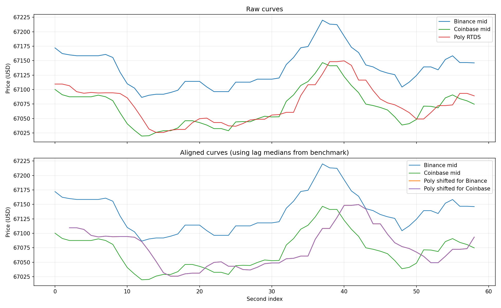

# Feed Lag Report

- Duration: `60.0s`
- Catch-up threshold: `Binance move >= 5.0 USD`
- Curve lag window/search: `20s`, `0..15s`
- CSV: `feed_lag_alignment_260331_151247_poland_wroclaw.csv`
- Plot: `feed_lag_alignment_260331_151247_poland_wroclaw.png`

## Polymarket Signal Staleness
- Binance tick -> Poly age: n=22293  min/mean/median/max = 0.0 / 600.4 / 566.7 / 2008.8 ms
- Coinbase tick -> Poly age: n=864  min/mean/median/max = 8.8 / 599.9 / 598.1 / 1586.1 ms

## Price Gap
- Poly - Binance: n=59  mean signed = -62.14 (median -63.48) USD; |gap| min/mean/median/max = 17.05 / 62.14 / 63.48 / 99.16 USD
- Poly - Coinbase: n=59  mean signed = +5.86 (median +6.14) USD; |gap| min/mean/median/max = 0.79 / 15.99 / 14.43 / 49.81 USD
- last Poly - Binance: n=22293  mean signed = -61.42 (median -64.82) USD; |gap| min/mean/median/max = 0.82 / 61.42 / 64.82 / 111.70 USD
- last Poly - Coinbase: n=864  mean signed = -0.64 (median -3.08) USD; |gap| min/mean/median/max = 0.05 / 18.59 / 16.93 / 66.03 USD

## Catch-up
- Binance move -> next Poly: n=8  min/mean/median/max = 12.0 / 300.3 / 305.4 / 691.8 ms

## Curve Lag
- Binance -> Poly lag(sec): 1.0 / 1.7 / 2.0; median=2.0; windows=24; corr(mean/median)=0.731/0.757
- Coinbase -> Poly lag(sec): 2.0 / 2.0 / 2.0; median=2.0; windows=24; corr(mean/median)=0.794/0.807

## Supplement
- binance skew: n=59  min/mean/median/max = 0.1 / 13.5 / 6.9 / 85.1 ms
- coinbase skew: n=59  min/mean/median/max = 1.3 / 231.3 / 156.1 / 996.8 ms
- binance inter-arrival: 0.0 / 2.6 / 331.0
- coinbase inter-arrival: 0.0 / 68.6 / 1190.5
- polymarket_rtds inter-arrival: 469.6 / 1015.6 / 2015.8

## Plot

