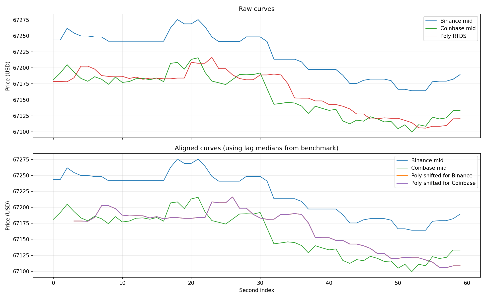

# Feed Lag Report

- Duration: `60.0s`
- Catch-up threshold: `Binance move >= 5.0 USD`
- Curve lag window/search: `20s`, `0..15s`
- CSV: `feed_lag_alignment_260331_151554_montenegro_podgorica.csv`
- Plot: `feed_lag_alignment_260331_151554_montenegro_podgorica.png`

## Polymarket Signal Staleness
- Binance tick -> Poly age: n=16776  min/mean/median/max = 0.0 / 548.6 / 486.2 / 1723.0 ms
- Coinbase tick -> Poly age: n=1215  min/mean/median/max = 0.1 / 608.5 / 581.6 / 1594.8 ms

## Price Gap
- Poly - Binance: n=60  mean signed = -57.40 (median -58.36) USD; |gap| min/mean/median/max = 24.57 / 57.40 / 58.36 / 91.48 USD
- Poly - Coinbase: n=61  mean signed = +4.13 (median +4.29) USD; |gap| min/mean/median/max = 0.90 / 11.50 / 9.72 / 44.82 USD
- last Poly - Binance: n=16776  mean signed = -56.62 (median -57.13) USD; |gap| min/mean/median/max = 23.21 / 56.62 / 57.13 / 91.51 USD
- last Poly - Coinbase: n=1215  mean signed = +4.66 (median +4.03) USD; |gap| min/mean/median/max = 0.02 / 13.31 / 10.86 / 47.35 USD

## Catch-up
- Binance move -> next Poly: n=4  min/mean/median/max = 41.2 / 381.8 / 298.2 / 889.9 ms

## Curve Lag
- Binance -> Poly lag(sec): 2.0 / 2.9 / 12.0; median=3.0; windows=25; corr(mean/median)=0.619/0.598
- Coinbase -> Poly lag(sec): 3.0 / 3.0 / 3.0; median=3.0; windows=25; corr(mean/median)=0.695/0.649

## Supplement
- binance skew: n=60  min/mean/median/max = 0.0 / 36.2 / 28.4 / 214.9 ms
- coinbase skew: n=61  min/mean/median/max = 0.0 / 136.1 / 70.2 / 1089.7 ms
- binance inter-arrival: 0.0 / 3.5 / 724.4
- coinbase inter-arrival: 0.0 / 49.1 / 1409.7
- polymarket_rtds inter-arrival: 46.5 / 986.3 / 1736.9

## Plot

