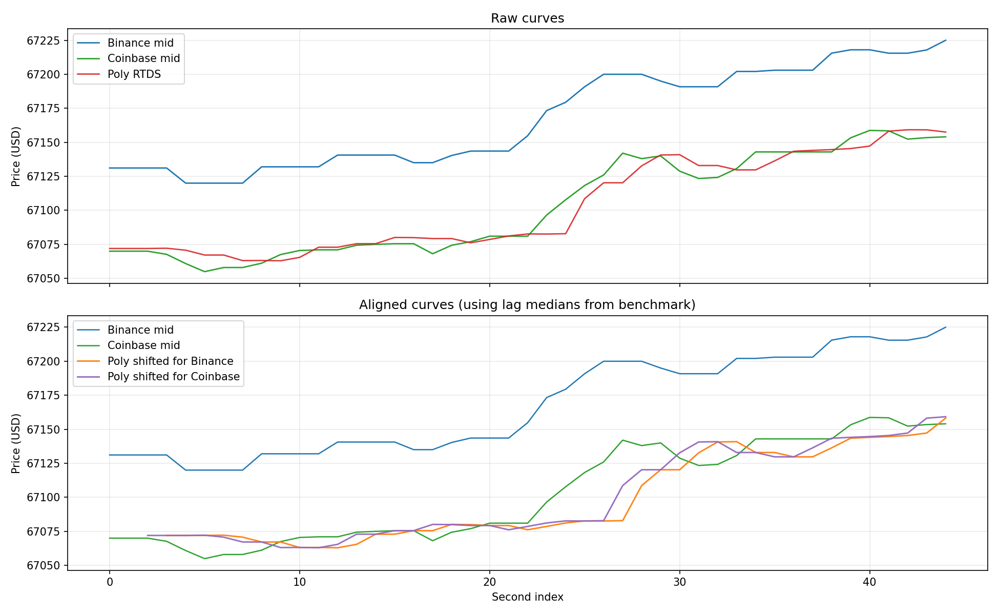

# Feed Lag Report

- Duration: `60.0s`
- Catch-up threshold: `Binance move >= 5.0 USD`
- Curve lag window/search: `20s`, `0..15s`
- CSV: `feed_lag_alignment_260331_152250_portugal_lisbon.csv`
- Plot: `feed_lag_alignment_260331_152250_portugal_lisbon.png`

## Polymarket Signal Staleness
- Binance tick -> Poly age: n=10240  min/mean/median/max = 1.2 / 882.1 / 606.6 / 7372.1 ms
- Coinbase tick -> Poly age: n=883  min/mean/median/max = 5.4 / 870.8 / 561.4 / 7376.8 ms

## Price Gap
- Poly - Binance: n=44  mean signed = -63.44 (median -60.42) USD; |gap| min/mean/median/max = 49.95 / 63.44 / 60.42 / 90.49 USD
- Poly - Coinbase: n=45  mean signed = -0.95 (median +0.68) USD; |gap| min/mean/median/max = 0.15 / 7.04 / 4.60 / 25.78 USD
- last Poly - Binance: n=10240  mean signed = -68.58 (median -66.67) USD; |gap| min/mean/median/max = 49.28 / 68.58 / 66.67 / 108.01 USD
- last Poly - Coinbase: n=883  mean signed = -9.83 (median -7.85) USD; |gap| min/mean/median/max = 0.02 / 12.64 / 9.91 / 42.51 USD

## Catch-up
- Binance move -> next Poly: n=3  min/mean/median/max = 189.8 / 346.0 / 424.0 / 424.1 ms

## Curve Lag
- Binance -> Poly lag(sec): 3.0 / 3.0 / 3.0; median=3.0; windows=10; corr(mean/median)=0.792/0.761
- Coinbase -> Poly lag(sec): 2.0 / 2.0 / 2.0; median=2.0; windows=10; corr(mean/median)=0.793/0.764

## Supplement
- binance skew: n=44  min/mean/median/max = 0.1 / 53.8 / 42.3 / 276.5 ms
- coinbase skew: n=45  min/mean/median/max = 2.0 / 312.3 / 254.1 / 1035.5 ms
- binance inter-arrival: 0.0 / 5.0 / 348.0
- coinbase inter-arrival: 0.0 / 58.3 / 1164.6
- polymarket_rtds inter-arrival: 449.8 / 1001.3 / 1816.8

## Plot

