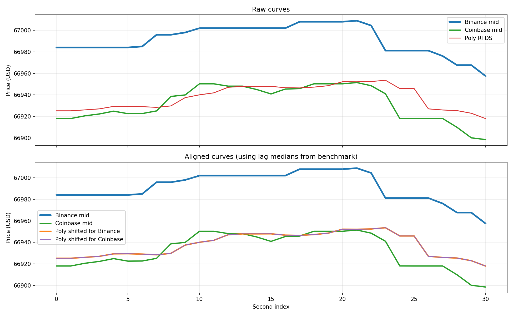

# Feed Lag Report

- Duration: `60.0s`
- Catch-up threshold: `Binance move >= 5.0 USD`
- Curve lag window/search: `20s`, `0..15s`
- CSV: `feed_lag_alignment_260331_154413_rs_pirot.csv`
- Plot: `feed_lag_alignment_260331_154413_rs_pirot.png`

## Polymarket Signal Staleness
- Binance tick -> Poly age: n=5768  min/mean/median/max = 0.1 / 559.3 / 510.4 / 1575.4 ms
- Coinbase tick -> Poly age: n=294  min/mean/median/max = 3.1 / 530.2 / 501.0 / 1496.0 ms

## Price Gap
- Poly - Binance: n=31  mean signed = -54.12 (median -55.17) USD; |gap| min/mean/median/max = 32.03 / 54.12 / 55.17 / 66.12 USD
- Poly - Coinbase: n=31  mean signed = +5.81 (median +2.88) USD; |gap| min/mean/median/max = 0.25 / 8.39 / 4.74 / 35.51 USD
- last Poly - Binance: n=5768  mean signed = -52.51 (median -54.76) USD; |gap| min/mean/median/max = 27.55 / 52.51 / 54.76 / 67.46 USD
- last Poly - Coinbase: n=294  mean signed = +4.07 (median +1.92) USD; |gap| min/mean/median/max = 0.13 / 8.51 / 6.24 / 35.90 USD

## Catch-up
- Binance move -> next Poly: no samples

## Curve Lag
- Binance -> Poly lag(sec): no samples (increase --duration)
- Coinbase -> Poly lag(sec): no samples (increase --duration)

## Supplement
- binance skew: n=31  min/mean/median/max = 2.7 / 45.7 / 31.3 / 304.8 ms
- coinbase skew: n=31  min/mean/median/max = 9.6 / 165.2 / 126.8 / 902.1 ms
- binance inter-arrival: 0.0 / 5.3 / 409.7
- coinbase inter-arrival: 0.0 / 98.1 / 948.7
- polymarket_rtds inter-arrival: 340.4 / 989.9 / 1622.7

## Plot

