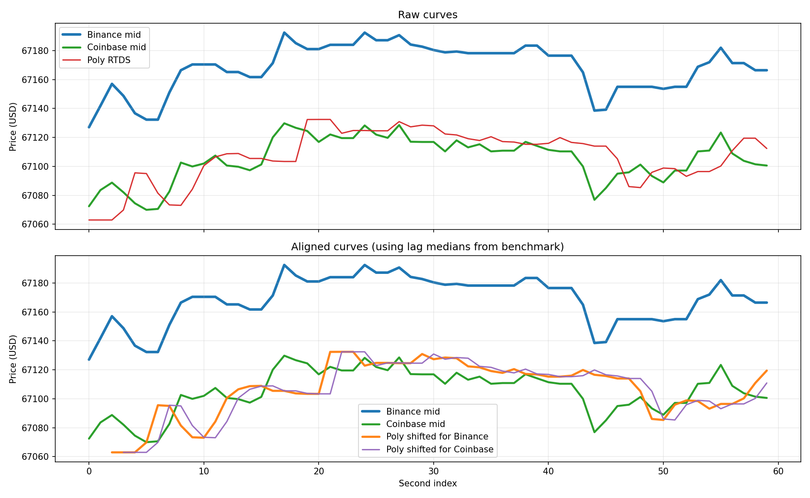

# Feed Lag Report

- Duration: `60.0s`
- Catch-up threshold: `Binance move >= 5.0 USD`
- Curve lag window/search: `20s`, `0..15s`
- CSV: `feed_lag_alignment_260331_162554_austria_vienna.csv`
- Plot: `feed_lag_alignment_260331_162554_austria_vienna.png`

## Polymarket Signal Staleness
- Binance tick -> Poly age: n=19398  min/mean/median/max = 0.2 / 635.3 / 622.0 / 1821.7 ms
- Coinbase tick -> Poly age: n=960  min/mean/median/max = 0.5 / 595.4 / 607.4 / 1694.1 ms

## Price Gap
- Poly - Binance: n=59  mean signed = -60.62 (median -59.22) USD; |gap| min/mean/median/max = 24.55 / 60.62 / 59.22 / 94.70 USD
- Poly - Coinbase: n=59  mean signed = +3.05 (median +5.96) USD; |gap| min/mean/median/max = 0.05 / 10.70 / 10.13 / 37.11 USD
- last Poly - Binance: n=19398  mean signed = -64.60 (median -60.58) USD; |gap| min/mean/median/max = 21.50 / 64.60 / 60.58 / 99.03 USD
- last Poly - Coinbase: n=960  mean signed = +4.35 (median +7.18) USD; |gap| min/mean/median/max = 0.04 / 14.95 / 12.23 / 42.50 USD

## Catch-up
- Binance move -> next Poly: n=7  min/mean/median/max = 154.0 / 522.5 / 317.9 / 1358.3 ms

## Curve Lag
- Binance -> Poly lag(sec): 2.0 / 2.3 / 3.0; median=2.0; windows=25; corr(mean/median)=0.762/0.787
- Coinbase -> Poly lag(sec): 2.0 / 2.9 / 3.0; median=3.0; windows=25; corr(mean/median)=0.680/0.674

## Supplement
- binance skew: n=59  min/mean/median/max = 0.0 / 27.7 / 14.6 / 260.1 ms
- coinbase skew: n=59  min/mean/median/max = 3.1 / 202.1 / 111.1 / 880.0 ms
- binance inter-arrival: 0.0 / 3.0 / 362.7
- coinbase inter-arrival: 0.0 / 60.5 / 1180.4
- polymarket_rtds inter-arrival: 303.4 / 1007.7 / 1832.2

## Plot

