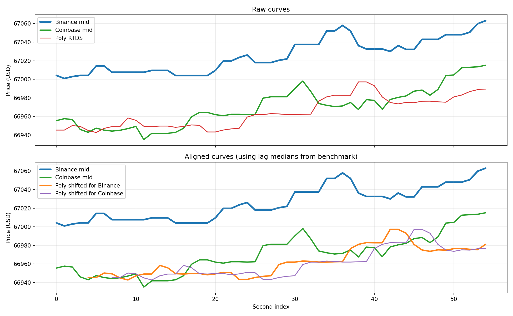

# Feed Lag Report

- Duration: `60.0s`
- Catch-up threshold: `Binance move >= 5.0 USD`
- Curve lag window/search: `20s`, `0..15s`
- CSV: `feed_lag_alignment_260331_163726_bg_sofia.csv`
- Plot: `feed_lag_alignment_260331_163726_bg_sofia.png`

## Polymarket Signal Staleness
- Binance tick -> Poly age: n=12900  min/mean/median/max = 3.5 / 635.4 / 554.1 / 1912.6 ms
- Coinbase tick -> Poly age: n=703  min/mean/median/max = 1.3 / 588.3 / 561.6 / 1926.7 ms

## Price Gap
- Poly - Binance: n=58  mean signed = -60.10 (median -59.25) USD; |gap| min/mean/median/max = 43.18 / 60.10 / 59.25 / 74.96 USD
- Poly - Coinbase: n=54  mean signed = -0.12 (median -0.04) USD; |gap| min/mean/median/max = 0.01 / 6.14 / 4.62 / 23.21 USD
- last Poly - Binance: n=12900  mean signed = -62.62 (median -61.72) USD; |gap| min/mean/median/max = 39.05 / 62.62 / 61.72 / 79.24 USD
- last Poly - Coinbase: n=703  mean signed = -5.65 (median -6.29) USD; |gap| min/mean/median/max = 0.01 / 9.07 / 8.51 / 26.52 USD

## Catch-up
- Binance move -> next Poly: n=2  min/mean/median/max = 272.2 / 644.3 / 644.3 / 1016.5 ms

## Curve Lag
- Binance -> Poly lag(sec): 3.0 / 3.6 / 4.0; median=4.0; windows=23; corr(mean/median)=0.678/0.654
- Coinbase -> Poly lag(sec): 7.0 / 7.3 / 8.0; median=7.0; windows=20; corr(mean/median)=0.643/0.634

## Supplement
- binance skew: n=58  min/mean/median/max = 5.2 / 120.7 / 68.6 / 1032.6 ms
- coinbase skew: n=54  min/mean/median/max = 8.1 / 280.8 / 211.8 / 1008.5 ms
- binance inter-arrival: 0.0 / 4.5 / 1056.2
- coinbase inter-arrival: 0.0 / 76.7 / 1768.6
- polymarket_rtds inter-arrival: 0.1 / 993.3 / 1946.2

## Plot

