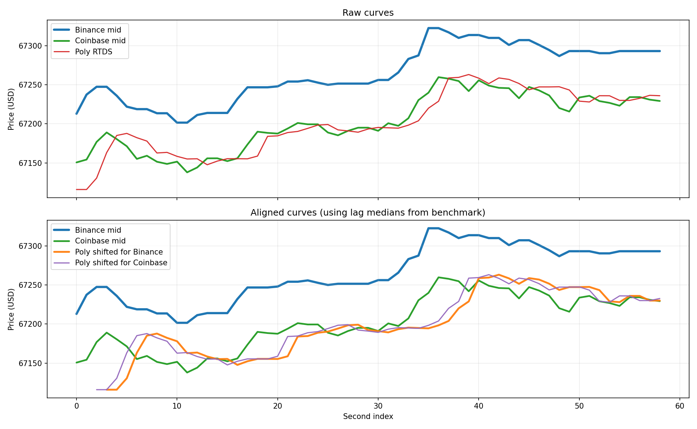

# Feed Lag Report

- Duration: `60.0s`
- Catch-up threshold: `Binance move >= 5.0 USD`
- Curve lag window/search: `20s`, `0..15s`
- CSV: `feed_lag_alignment_260331_163932_cy_limassol.csv`
- Plot: `feed_lag_alignment_260331_163932_cy_limassol.png`

## Polymarket Signal Staleness
- Binance tick -> Poly age: n=18173  min/mean/median/max = 0.1 / 551.9 / 492.1 / 1842.0 ms
- Coinbase tick -> Poly age: n=1366  min/mean/median/max = 1.6 / 509.7 / 464.3 / 1658.4 ms

## Price Gap
- Poly - Binance: n=59  mean signed = -61.00 (median -58.60) USD; |gap| min/mean/median/max = 36.55 / 61.00 / 58.60 / 106.89 USD
- Poly - Coinbase: n=59  mean signed = -0.65 (median +1.21) USD; |gap| min/mean/median/max = 0.04 / 12.09 / 9.16 / 51.94 USD
- last Poly - Binance: n=18173  mean signed = -65.85 (median -58.66) USD; |gap| min/mean/median/max = 31.05 / 65.85 / 58.66 / 121.75 USD
- last Poly - Coinbase: n=1366  mean signed = -9.38 (median -1.10) USD; |gap| min/mean/median/max = 0.05 / 23.24 / 17.40 / 73.02 USD

## Catch-up
- Binance move -> next Poly: n=2  min/mean/median/max = 307.7 / 610.6 / 610.6 / 913.6 ms

## Curve Lag
- Binance -> Poly lag(sec): 2.0 / 2.5 / 3.0; median=3.0; windows=24; corr(mean/median)=0.776/0.763
- Coinbase -> Poly lag(sec): 1.0 / 1.6 / 2.0; median=2.0; windows=24; corr(mean/median)=0.712/0.695

## Supplement
- binance skew: n=59  min/mean/median/max = 0.1 / 69.9 / 51.0 / 633.4 ms
- coinbase skew: n=59  min/mean/median/max = 0.4 / 184.6 / 79.1 / 1379.1 ms
- binance inter-arrival: 0.0 / 3.2 / 1121.6
- coinbase inter-arrival: 0.0 / 41.7 / 1444.9
- polymarket_rtds inter-arrival: 185.8 / 1006.5 / 1847.0

## Plot

