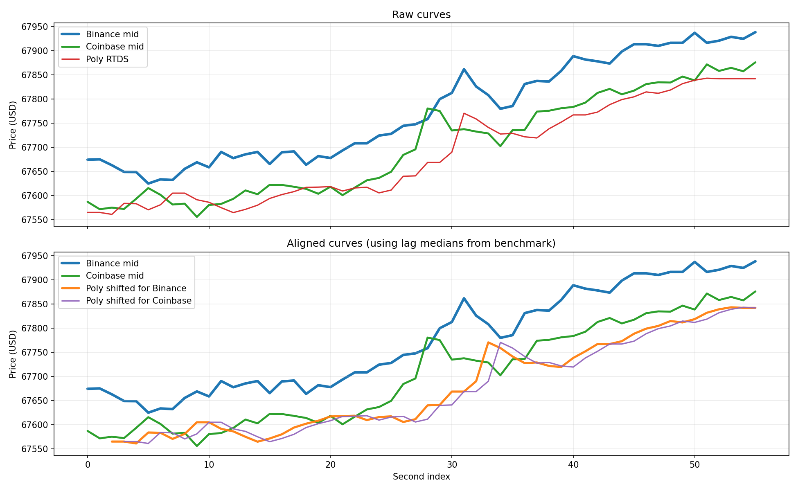

# Feed Lag Report

- Duration: `120.0s`
- Catch-up threshold: `Binance move >= 5.0 USD`
- Curve lag window/search: `20s`, `0..15s`
- CSV: `feed_lag_alignment_260331_164250_cy_limassol.csv`
- Plot: `feed_lag_alignment_260331_164250_cy_limassol.png`

## Polymarket Signal Staleness
- Binance tick -> Poly age: n=46760  min/mean/median/max = 0.8 / 950.4 / 573.6 / 8032.2 ms
- Coinbase tick -> Poly age: n=4653  min/mean/median/max = 0.6 / 897.9 / 642.2 / 8238.7 ms

## Price Gap
- Poly - Binance: n=106  mean signed = -70.85 (median -66.71) USD; |gap| min/mean/median/max = 8.98 / 71.50 / 66.71 / 172.74 USD
- Poly - Coinbase: n=111  mean signed = -7.14 (median -6.02) USD; |gap| min/mean/median/max = 0.12 / 22.08 / 16.80 / 111.91 USD
- last Poly - Binance: n=46760  mean signed = -69.14 (median -72.40) USD; |gap| min/mean/median/max = 0.28 / 69.91 / 72.40 / 138.78 USD
- last Poly - Coinbase: n=4653  mean signed = -23.53 (median -20.92) USD; |gap| min/mean/median/max = 0.04 / 37.07 / 30.92 / 138.76 USD

## Catch-up
- Binance move -> next Poly: n=12  min/mean/median/max = 57.1 / 391.5 / 325.8 / 1127.8 ms

## Curve Lag
- Binance -> Poly lag(sec): 0.0 / 4.2 / 15.0; median=2.0; windows=21; corr(mean/median)=0.444/0.463
- Coinbase -> Poly lag(sec): 0.0 / 4.5 / 13.0; median=3.0; windows=84; corr(mean/median)=0.673/0.689

## Supplement
- binance skew: n=106  min/mean/median/max = 0.0 / 16301.8 / 5379.1 / 59131.2 ms
- coinbase skew: n=111  min/mean/median/max = 0.1 / 89.9 / 62.8 / 690.9 ms
- binance inter-arrival: 0.0 / 1.2 / 678.3
- coinbase inter-arrival: 0.0 / 25.4 / 1143.0
- polymarket_rtds inter-arrival: 310.4 / 1071.1 / 8295.9

## Plot

